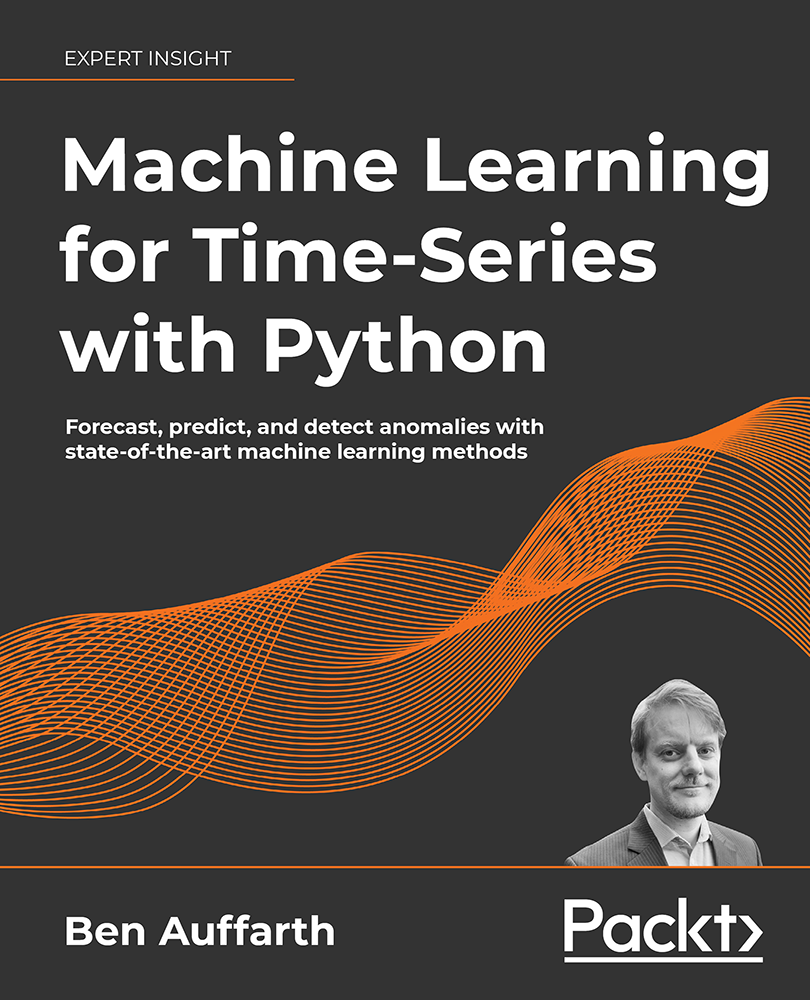

# Machine-Learning-for-Time-Series-with-Python

Become proficient in deriving insights from time-series data and analyzing a model’s performance

## Links

* [Amazon](https://www.amazon.com/Machine-Learning-Time-Python-state/dp/1801819629/)
* [Packt Publishing](https://www.packtpub.com/product/machine-learning-for-time-series-with-python/9781801819626)

## Key Features
* Explore popular and modern machine learning methods including the latest online and deep learning algorithms
* Learn to increase the accuracy of your predictions by matching the right model with the right problem
* Master time-series via real-world case studies on operations management, digital marketing, finance, and healthcare

## What you will learn
- Understand the main classes of time-series and learn how to detect outliers and patterns
- Choose the right method to solve time-series problems
- Characterize seasonal and correlation patterns through autocorrelation and statistical techniques
- Get to grips with time-series data visualization
- Understand classical time-series models like ARMA and ARIMA
- Implement deep learning models, like Gaussian processes, transformers, and state-of-the-art machine learning models
- Become familiar with many libraries like Prophet, XGboost, and TensorFlow

## Who This Book Is For
This book is ideal for data analysts, data scientists, and Python developers who are looking to perform time-series analysis to effectively predict outcomes. Basic knowledge of the Python language is essential. Familiarity with statistics is desirable.

## Table of Contents
1. Introduction to Time-Series with Python
2. Time-Series Analysis with Python
3. Preprocessing Time-Series
4. Introduction to Machine Learning for Time-Series
5. Forecasting with Moving Averages and Autoregressive Models
6. Unsupervised Methods for Time-Series
7. Machine Learning Models for Time-Series 
8. Online Learning for Time-Series
9. Probabilistic Models for Time-Series
10. Deep Learning for Time-Series
11. Reinforcement Learning for Time-Series
12. Multivariate Forecasting

## Author Notes

I've heard from a few people struggling with tsfresh and featuretools for chapter 3.

[My PR](https://github.com/blue-yonder/tsfresh/pull/912) for tsfresh was merged mid-December fixing a version incompatibility - featuretools went through many breaking changes with the release of version 1.0.0 (congratulations to the team!). Please see how to fix any problems in the [discussion here](https://github.com/PacktPublishing/Machine-Learning-for-Time-Series-with-Python/issues/2).
### Download a free PDF

 <i>If you have already purchased a print or Kindle version of this book, you can get a DRM-free PDF version at no cost. Simply click on the link to claim your free PDF.</i>

 <a href="https://packt.link/free-ebook/9781801819626">https://packt.link/free-ebook/9781801819626 </a> 
